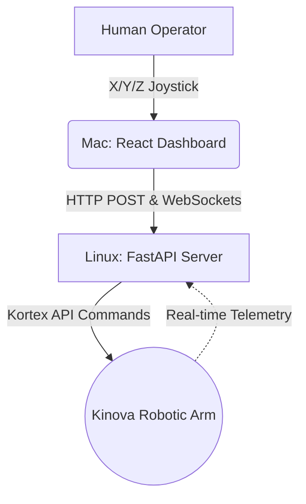

# 📦 Amazon FTR: Automated Robotics Inspection System


A robust, high-speed full-stack web interface designed to teleport physical velocity commands to an industrial robotic arm natively across a network. Built as a capstone project to automate the notoriously slow, manual inspection of return processing in Amazon warehouses.

## 📖 The Vision
Amazon handles a massive volume of returns daily, creating a logistical bottleneck. Manual inspection is time-consuming, prone to error, and limits throughput. 

**Our Solution:** An intelligent, network-driven robotic teleoperation system that completely decouples human operators from the hazardous sorting floor. By leveraging precise ROS 2 manipulation remotely, we slash repetitive labor costs and drastically increase restitution speeds.

---

## 🏗️ System Architecture
This project has migrated from a fragile ROS 2-based architecture to a robust, native **Kortex API** implementation, utilizing a high-performance **FastAPI** backend. 



### Lane 1: Inbound Control
Web UI joystick movements are fired as guaranteed HTTP requests directly to the FastAPI backend (`main.py`). This completely negates ROS 2 DDS discovery bugs and ensures high-speed, direct hardware control.

### Lane 2: Outbound Diagnostics
The React app simultaneously connects to the FastAPI WebSocket endpoints to subscribe to real-time motor torque and force data telemetry for precise object manipulation.

---

## 🚀 Setup & Deployment

### Part 1: Backend Setup
*The high-performance API that controls the robot directly.*

1. **Install Requirements:** Ensure your Python environment has the required dependencies.
   *(Optional) Create and activate a virtual environment:*
   ```bash
   python -m venv venv
   source venv/bin/activate
   ```
   *Install project dependencies (like FastAPI, Uvicorn, etc. Depending on your setup)*:
   ```bash
   pip install -r requirements.txt
   ```

2. **Start the FastAPI Server:**
   Navigate to the `/backend` folder and run the server using `uvicorn`.
   ```bash
   cd backend
   uvicorn main:app --reload
   ```

### Part 2: Mac / Web Dashboard Setup
*The Operator Control Station.*

1. **Install Dependencies & Run:**
   ```bash
   npm install
   npm run dev
   ```
2. **Connect the UI:** 
   * When the React app opens in your browser, configure it to point to your new FastAPI backend (e.g. `127.0.0.1:8000` or the respective Linux machine IP).

3. **Drive the Robot:**
   Leverage the updated UI controls to teleport precise kinematics natively over the high-speed Kortex API!
