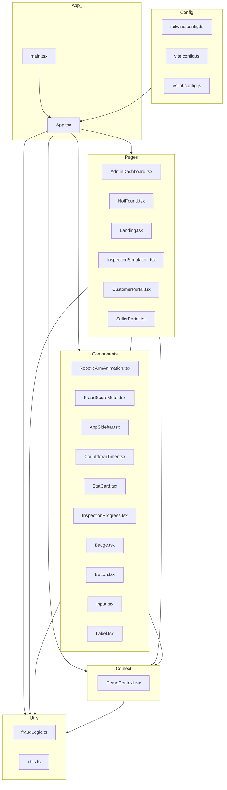

    

    <b>Automatic Architecture Diagrams from Code</b> 
    <a href="https://github.com/swark-io/swark">GitHub</a> • <a href="https://swark.io">Website</a> • <a href="mailto:contact@swark.io">Contact Us</a>

## Usage Instructions

1. **Render the Diagram**: Use the links below to open it in Mermaid Live Editor, or install the [Mermaid Support](https://marketplace.visualstudio.com/items?itemName=bierner.markdown-mermaid) extension.
2. **Recommended Model**: If available for you, use `claude-3.5-sonnet` [language model](vscode://settings/swark.languageModel). It can process more files and generates better diagrams.
3. **Iterate for Best Results**: Language models are non-deterministic. Generate the diagram multiple times and choose the best result.

## Generated Content
**Model**: GPT-4o - [Change Model](vscode://settings/swark.languageModel)  
**Mermaid Live Editor**: [View](https://mermaid.live/view#pako:eNqFVNtu2zAM_RVDz20_IA8D0mQFBqRDMKd7mYdBthhHgy6GRK0div77KPmqJF2fSB6eQ0uHtl9ZYwWwFatM63h3Kg7byhSFD3Vf7nkLPiJFsRZami33p9pyJ35ULAfu0L9U7GfP_WrxwQYTWWOa9XfcCGlaag9Z1v1ifAcNSmtKqYPiMSPqNTjTbYJHq8HtrUOuSJEDGbcEpRbMZbnggRGVyQzZWN1ZAwYHV77Z2qJs1k6vjdTjUa-g2dMfHA-ibKyDR0BwpDhDMva660opoOaROBf53cljFPbZHKROA3Mgvzty3PQ7HNN3_N872zrwPnN_BDPNPRctEC3FvBMQkyl9cvakLmAaTvHsDalBpfeD4gcbMQgv2Mu2oO0AkHhR_XfEE0o17PMY97CzrWxIPxckn44WIpu6Kc6Ny7G0ql_TBvvVZXd85DL6oil8dMOjbHvNgUv1LNOXhUN616T-8ojfJcZl_KFwpfu53EkT_QGvKBkZvy9uQgcubm8_zX-BEci_ghmdNjFCg7MRSkOuqJf4pJ_BxYRZt-xc4NOYvpeK81HR-oTRQQcaWTAj7IbRV0ObEfRvfCWvT6ChYquiYgKOPCis2BuRQic4wlZy2pRmK3QBbhgPaMu_phlrZ0N7YqsjVx7e_gEc2d7z) | [Edit](https://mermaid.live/edit#pako:eNqFVNtu2zAM_RVDz20_IA8D0mQFBqRDMKd7mYdBthhHgy6GRK0div77KPmqJF2fSB6eQ0uHtl9ZYwWwFatM63h3Kg7byhSFD3Vf7nkLPiJFsRZami33p9pyJ35ULAfu0L9U7GfP_WrxwQYTWWOa9XfcCGlaag9Z1v1ifAcNSmtKqYPiMSPqNTjTbYJHq8HtrUOuSJEDGbcEpRbMZbnggRGVyQzZWN1ZAwYHV77Z2qJs1k6vjdTjUa-g2dMfHA-ibKyDR0BwpDhDMva660opoOaROBf53cljFPbZHKROA3Mgvzty3PQ7HNN3_N872zrwPnN_BDPNPRctEC3FvBMQkyl9cvakLmAaTvHsDalBpfeD4gcbMQgv2Mu2oO0AkHhR_XfEE0o17PMY97CzrWxIPxckn44WIpu6Kc6Ny7G0ql_TBvvVZXd85DL6oil8dMOjbHvNgUv1LNOXhUN616T-8ojfJcZl_KFwpfu53EkT_QGvKBkZvy9uQgcubm8_zX-BEci_ghmdNjFCg7MRSkOuqJf4pJ_BxYRZt-xc4NOYvpeK81HR-oTRQQcaWTAj7IbRV0ObEfRvfCWvT6ChYquiYgKOPCis2BuRQic4wlZy2pRmK3QBbhgPaMu_phlrZ0N7YqsjVx7e_gEc2d7z)

